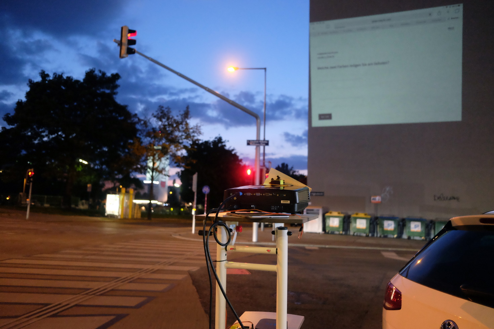
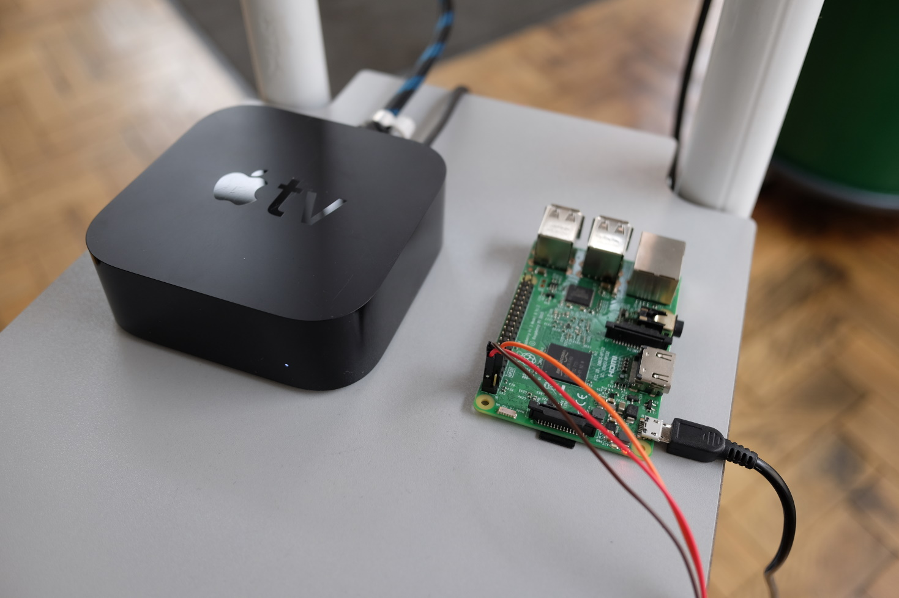

# Shutter

Technical contribution to art project ["Simple Machine"](https://www.peterreischl.com/simple-machine/) by Peter Reischl.

  

The goal was to come up with a solution (hard- and software) in order to allow a projector to show/hide its projection quickly based on the inputs of a wirelessly connected tablet.

### Hardware

As startup and shutdown times on projectors are typically rather long, a solution based on turning the projector on and off was not good enough. Thus, as an alternative, I created a mechanical shutter that can hide and un-hide the projection. For this, I used a Raspberry Pi equipped with a servo motor which can move a piece of cardboard up and down to cover the projector lense. The motor is hooked up to the Pi's GPIO port.

  

### Software

The motor on the Raspberry Pi is controlled using Python scripts, one for moving the cardboard up (in order to show the projection) and one for moving it down (hiding the projection). Since the project setup required these actions to be done at certain times when participants filled out a (web-based) questionnaire, I've added a Spring Boot powered backend API to allow access to the python script via Javascript XHR calls from the questionnaire's HTML.

  